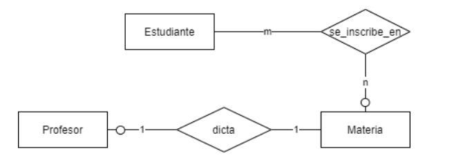

# Modelo de Entidad-Relación

### Modelo Conceptual (MC) de Datos:
- **Descripción general**: Proporciona una visión clara y de alto nivel de los requisitos de datos de los usuarios
- **Representación de Datos**: Muestra qué datos se deben capturar del mundo real, cómo se organizan, sus relaciones y características
- **Independencia de Plataforma**
- **Validación y Consenso**

## Modelo de Entidad Relación
- Herramienta que permite describir los datos involucrados en un dominio del mundo real (modelo) en términos de objetos y sus relaciones
- Modelo Conceptual

## Diagramas de Entidad Relación (DER)
- **Entidades**: 
    - cualquier cosa del negocio que necesite representarse en la base de datos, desde una persona, un objeto, un evento hasta un concepto
    - no son representadas explícitamente en el DER
    - **fuertes**: 
        - tienen una existencia independiente de cualquier otra entidad, se identifican sólo por atributos propios
    - **débiles**: 
        - derivan su existencia de otra entidad y necesitan de ella para formar su identificador
        - se denotan con un rectángulo con linea doble
        - a la interrelación que vincula una entidad débil con su entidad fuerte correspondiente (interrelación identificatoria) se la denota con un rombo con línea doble
- **Set of entities**: 
    - clases o tipos de objetos en nuestro modelo
    - se denota con un rectángulo, con el nombre de la clase dentro de él
- **Atributos**: 
    - propiedades descriptivas de las entidades que las representan como tal
    - toda entidad tiene al menos una clave primaria (**primary key**), un conjunto minimal de atributos identificatorios
    - se denotan con una elipse vinculada a una entidad, con el nombre dentro
    - se permiten atributos multivaluados (conjunto de valores, se denotan con línea doble) y compuestos (jerarquía de elipses)  
- **Interrelaciones**: 
    - relaciones entre clases de entidades
    - se representan con un rombo que vincula las entidades participantes de la misma
- **Jerarquías**:
    - se tiene una superentidad o entidad padre y entidades hijas o subentidades, definidas por un discriminante
    - estas subentidades pueden tener atributos distintos entre sí e incluso interrelaciones diferentes
    - las subentidades heredan la clave de la entidad padre
    - cobertura: total o parcial (un elemento de la superentidad no necesariamente está en una subentidad)
    - solapamiento: disjunta (d) o con solapamiento (o)
- **Reglas de dominio adicionales**:
    - herramientas complementarias que permiten expresar conocimiento adicional del dominio del problema que no queda expresado en el diagrama

### Interrelaciones
- **Cardinalidad**: cantidad de elementos de una entidad que puedan estar interactuando a través de la interrelación, con elementos de otra entidad
    - Uno a uno
    - Uno a muchos
    - Muchos a muchos
- **Participación**:  
    - Parcial: 
        - no es necesario que todos los elementos de una entidad participen en la interrelación con otra
        - se denota poniendo una "O" sobre el vinculo
    - Total
- **Grado**: cantidad de Entidades participantes
    - Unarias (única entidad)
    - Binarias
    - Ternarias
    - N-arias
- **Rol**: cada entidad que participa en una interrelación lo hace en un rol particular. En relaciones UNARIAS siempre deben aclararse los roles
- **Atributos**: 
    - Solamente las del tipo muchos a muchos admiten atributos
    - Permiten que se repitan pares ordenados de entidades siempre y cuando tengan diferentes valores para un atributo identificatorio
- **Interrelaciones ternarias:**
    - aquellas en las que participan 3 entidades en forma simultánea 
    - una tripla de la ternaria siempre tendrá un elemento de cada entidad participante
    - la cardinalidad se define tomando de a dos entidades
    - la participación se define individualmente
- **Agregación**:
    - permite que una interrelación (junto con sus entidades vinculadas) pueda ser tratada como una entidad de alto nivel y pueda participar de interrelaciones
    - permite modelar relaciones ternarias en las que uno de los elementos de la terna es nulo
    - solo para relaciones muchos a muchos
    - se denota con un rectángulo conteniendo a la interrelación

> Ejemplo: En una universidad, los estudiantes se inscriben en materias. Un estudiante debe estar inscrito en al menos una materia. Cada materia es dictada por un único profesor y por cuestiones de carga horaria, cada profesor puede dictar a lo sumo una materia

# Consideraciones de Diseño
- Evitar **redundancia**
- Evitar modelar entidades como atributos (por ejemplo si una entidad tiene muchos atributos es una señal que puede faltar una abstracción más)
- Para las entidades se usan sustantivos en singular y verbos, para las interrelaciones
- Para la clave, debe seleccionarse un atributo que no vaya a cambiar con el tiempo. Sino generar una artificial (idEntidad)
- Trampa del Abanico:
    - una entidad participa en dos o más relaciones 1:N que salen "en abanico" (a entidades distintas)
    - problema: al intentar llegar de una entidad a otra a través de esas relaciones no queda claro cuál es el camino correcto (ambigüedad)
    - solución: reestructurar el modelo para dejar explícito el camino correcta. al hacer una consulta, el sistema debe dar una respuesta única
- Trampa del Sumidero:
    - una entidad intermedia participa parcialmente en una interrelación
    - problema: no existe camino válido entre las dos entidades externas, pueden quedar desconectadas
    - solución: reestructurar el modelo y agregar una interrelación explicita que complete el camino